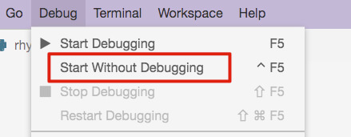
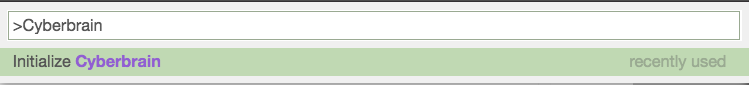

# How to run Cyberbrain in Gitpod

1. **Got to [Access Control](https://gitpod.io/access-control/), Make sure write access for GitHub is enabled**

   

2. **Switch to the "rhymer.py" tab**

   

3. **Run the program with "Start Without Debugging"**

   

4. **Press `Cmd+Shift+P` (or `Ctrl+Shift+P`) to open the command palette**

5. **Find the `Initialize Cyberbrain` command, press "Enter"**

   

6. **The trace graph will be opened on the right**

    

7. **Now you can play with it. To inspect on values, you need to open the Devtools console manually** (you can do that by right click in an empty space on the top bar)

    

## Note: it's also ok to initialize Cyberbrain first, then run the program.